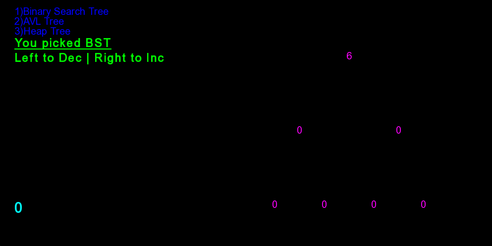

# VisualTree_SFML_Project
Designing BST, AVL, HEAP Tree visually on the SFML C++

## Introduction
Visualizing Binary Search Tree, AVL Tree and Heap Tree in Quadratic and Linear Form. Algorithm implementation is done in C++ and the visualization is done by using SFML.

### Pre-Requisities
* Visual Studio - IDE
* SFML - Visualization Tool
* Arial.ttf - Font Style

### **Setup**
* Clone the project in the directory and open the project in Visual Studio IDE.
* Check SFML documentation to setup necessary properties for the SFML visualization. 
> https://www.sfml-dev.org/tutorials/2.5/start-vc.php
* Check if arial.ttf file is in the same folder as .cpp file.
* Execute the application.
* Select one of the trees to visualize and enter integer to enter into the tree.

### **Screenshot**

